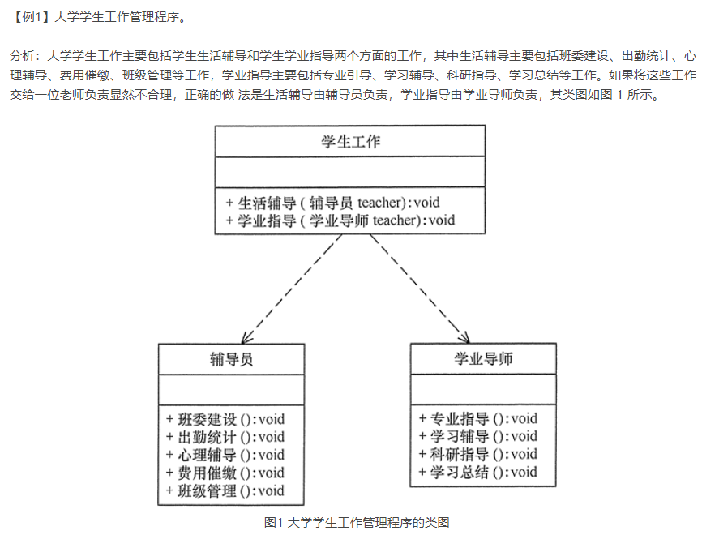
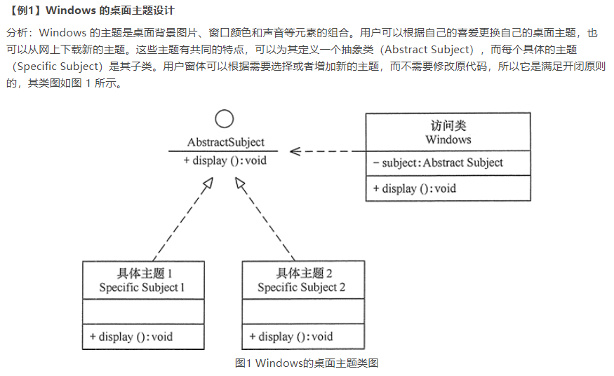
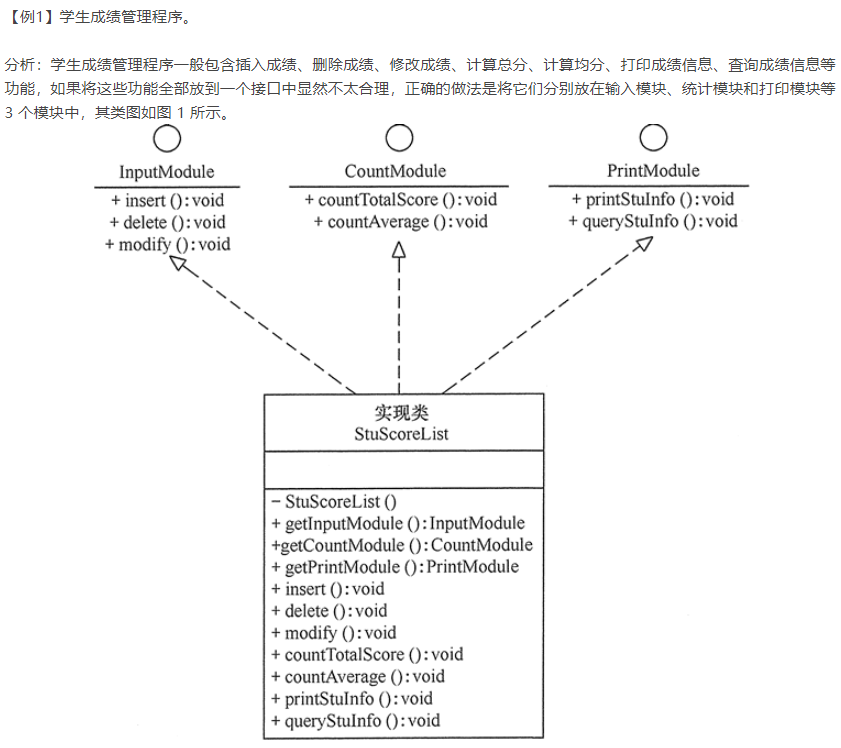
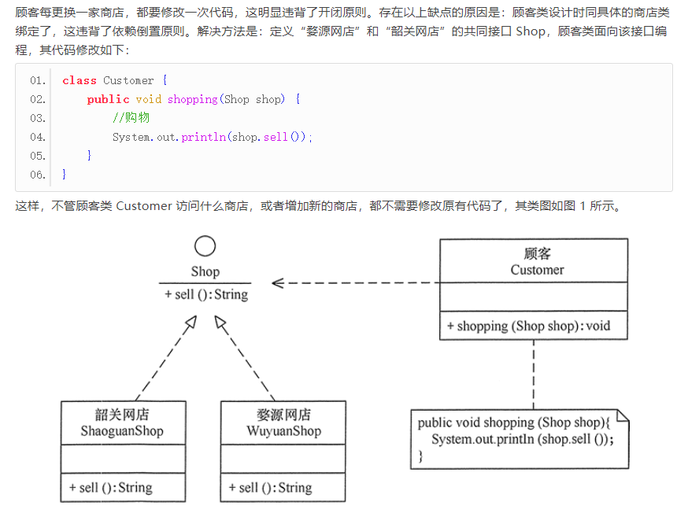
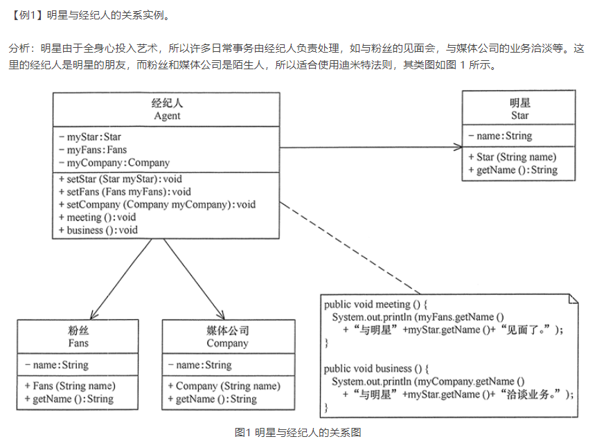

# 软件设计原则SOLID
 - S--单一职责原则
 - O--开放封闭原则
 - L--里式替换原则
 - I--接口隔离原则
 - D--依赖倒置和迪米特原则（最小知识原则）

# 单一职责原则
> 类中的不同职责需要将其分离出来，封装到不同的类或模块中，单一职责也适用于方法，一个方法尽可能的只做好一件事--[`单一职责`](http://c.biancheng.net/view/1327.html)

# 开放封闭原则
> 可以通过“抽象约束、封装变化”来实现开闭原则，即通过接口或者抽象类为软件实体定义一个相对稳定的抽象层，而将相同的可变因素封装在相同的具体实现类中。[`开闭原则`](http://c.biancheng.net/view/1322.html)

# 里式替换
> 子类可以扩展父类的功能，但不能改变父类原有的功能。也就是说：子类继承父类时，除添加新的方法完成新增功能外，尽量不要重写父类的方法。
# 接口隔离
> 定义一个接口分工要明细，不要在一个接口里定义很多职责方法，应该抽离出来分成多个接口

# 依赖倒置
> 任何类不应该从具体类派生，每个具体实现类都应该有一个接口或者抽象类，尽量遵循里式替换原则

# 迪米特原则
> 降低类与类之间的联系，陌生类之间应该通过代理类访问

