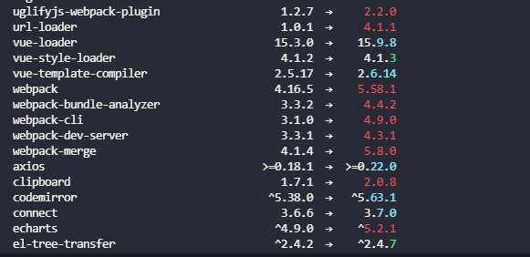
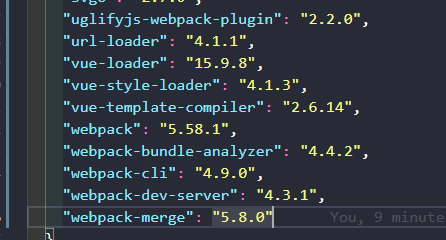
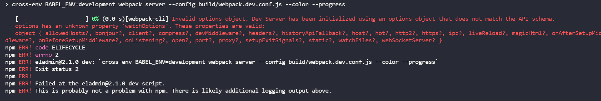
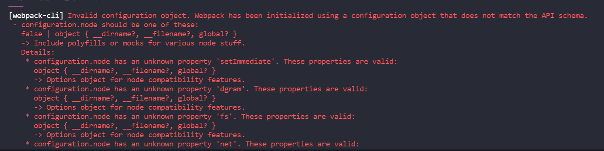
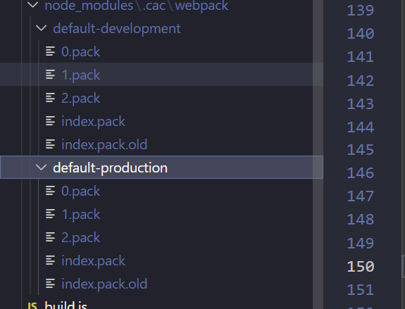

## 基于vue-element-admin项目升级webpack5
### 1.升级webpack和相关插件

>项目使用到的依赖比较多，一个一个升级太慢，这里用到 `npm-check-updates` 一键升级
>  #### 1.安装npm-check-updates 
>```cnpm i npm-check-updates -g```
> #### 2.在package.json的跟目录下执行npm-check-updates
> ```npm-check-updates```  
> 
> #### 3.执行ncu -u 检查package.json文件,执行完后package.json里面依赖版本都变成最新的版本，我们只需要升级webapck和相关插件的版本，其他webpack没有用到的可以先还原
> ```ncu -u```  
> 
> #### 4.执行`npm i `安装更新后的依赖包
> #### 5. 修改package.json里dev启动命令
```json
  "dev": "cross-env BABEL_ENV=development webpack-dev-server --inline --progress --config build/webpack.dev.conf.js"
```  
替换为  
```json
  "dev": "cross-env BABEL_ENV=development webpack server --config build/webpack.dev.conf.js --color --progress"
```  

>到这webpack5包升级操作就完成了，接下来大家可以开心的`npm run dev`启动项目
***
### 2.踩坑指北
#### 1.webpack-merge用法改变
webpack5使用解构的方式来配置，需要修改webpack.dev.conf.js和webpack.prod.conf.js引入方式
```javascript
const merge = require('webpack-merge')
```
替换为
```javascript
const { merge } = require('webpack-merge')
```

#### 2.webpack-dev-server报错
webpack-dev-server升级到最新版本，运行项目会出现之前配置的options报错，这里将webpack-dev-server还原到3.11.0版本  

```json
"webpack-dev-server": "^4.3.1",
```
替换为
```json
"webpack-dev-server": "^3.11.0",
```
#### 3.configuration.node 不兼容
Webpack 5移除了针对于 Node.js 原生模块, 开始不再自动填充这些 polyfills,屏蔽webpack.base.conf.js以下属性值

```js
  node: {
    // prevent webpack from injecting useless setImmediate polyfill because Vue
    // source contains it (although only uses it if it's native).
    setImmediate: false,
    // prevent webpack from injecting mocks to Node native modules
    // that does not make sense for the client
    dgram: 'empty',
    fs: 'empty',
    net: 'empty',
    tls: 'empty',
    child_process: 'empty'
  }
```
替换为
```js
    node: {
    // prevent webpack from injecting useless setImmediate polyfill because Vue
    // source contains it (although only uses it if it's native).
    // setImmediate: false,
    // // prevent webpack from injecting mocks to Node native modules
    // // that does not make sense for the client
    // dgram: 'empty',
    // fs: 'empty',
    // net: 'empty',
    // tls: 'empty',
    // child_process: 'empty'
  }
```
#### 4.资源文件的处理可以不再使用url-loader, file-loader
添加 4 种新的模块类型，来替换所有这些 loader  
>1、asset/resource 发送一个单独的文件并导出 URL。之前通过使用 file-loader 实现。 

>2、asset/inline 导出一个资源的 data URI。之前通过使用 url-loader 实现。 

>3、asset/source 导出资源的源代码。之前通过使用 raw-loader 实现。 

>4、asset 在导出一个 data URI 和发送一个单独的文件之间自动选择。之前通过使用 url-loader，并且配置资源体积限制实现。 
修改webpack.base.conf.js文件
```js
      {
        test: /\.(png|jpe?g|gif|svg)(\?.*)?$/,
        loader: 'url-loader',
        exclude: [resolve('src/icons')],
        options: {
          limit: 10000,
          name: utils.assetsPath('img/[name].[hash:7].[ext]')
        }
      },
      {
        test: /\.(mp4|webm|ogg|mp3|wav|flac|aac)(\?.*)?$/,
        loader: 'url-loader',
        options: {
          limit: 10000,
          name: utils.assetsPath('media/[name].[hash:7].[ext]')
        }
      },
      {
        test: /\.(woff2?|eot|ttf|otf)(\?.*)?$/,
        loader: 'url-loader',
        options: {
          limit: 10000,
          name: utils.assetsPath('fonts/[name].[hash:7].[ext]')
        }
      }
```
替换为
```js
      {
        test: /\.(png|jpe?g|gif|svg)(\?.*)?$/,
        type: 'asset',
        exclude: [resolve('src/icons')],
        parser: {
          dataUrlCondition: {
            maxSize: 10 * 1024 // 10kb
          }
        },
        generator: {
          filename: utils.assetsPath('img/[name].[hash:7].[ext]')
        }
      },
      {
        test: /\.(mp4|webm|ogg|mp3|wav|flac|aac)(\?.*)?$/,
        type: 'asset/resource',
        include: [
          resolve('src')
        ], // src是项目开发的目录
      },
      {
        test: /\.(woff2?|eot|ttf|otf)(\?.*)?$/,
        type: 'asset/resource',
        include: [
          resolve('src')
        ], // src是项目开发的目录
      }
```
#### 5.启动服务的差别
1.webpack4 启动服务
通过 webpack-dev-server 启动服务
2.webpack5 启动服务
内置使用 webpack serve 启动，
```json
  "dev": "cross-env BABEL_ENV=development webpack-dev-server --inline --progress --config build/webpack.dev.conf.js"
```  
替换为  
```json
  "dev": "cross-env BABEL_ENV=development webpack server --config build/webpack.dev.conf.js --color --progress"
``` 
并在webpack.dev.conf.js里devServer属性开启hot:true
```js
  devServer: {
    hot: true, // 增加配置
  },
```
#### 6.使用 copy-webpack-plugin 的差别
webpack5 支持的新版本里面需要配置的更加清楚,patterns属性里，修改webpack.base.conf.js和webpack.prod.conf.js里plugins属性
修改
```javascript
    // copy custom static assets
    new CopyWebpackPlugin([
      {
        from: path.resolve(__dirname, '../static'),
        to: config.dev.assetsSubDirectory,
        ignore: ['.*']
      }
    ])
```
替换为
```JavaScript
    // copy custom static assets
    new CopyWebpackPlugin({
      patterns: [
        {
          from: path.resolve(__dirname, '../static'),
          to: config.dev.assetsSubDirectory,
          globOptions: {
            dot: true,
            gitignore: true,
            ignore: ['.*'],
          }
        },
      ]
    })
```
#### 7.升级webpack5后，scss文件无法使用：export
升级之后，在scss文件定义变量后导出到js文件中，会发现导出为空
```scss
  $--color-primary: #1890ff;
  :export {
    theme: $--color-primary;
  }
```
```js
import variables from '@/styles/element-variables.scss'
console.log('variables', variables) // 此时变成了空对象{}
```
需要给这些scss变量文件增加loader处理，在webpack.base.conf.js添加一下文件的loader处理
```js
     {
        test: /\element-variables.scss|variables.scss$/i,
        include: [resolve('src/styles')],
        use: [
          {
            loader: "style-loader",
          },
          {
            loader: "css-loader",
            options: {
              importLoaders: 1,
              modules: {
                mode: "local",
              },
            },
          },
          {
            loader: "sass-loader",
          },
        ],
      },
```
在utils.js里对之前处理scss的loader配置里增加exclude排除对应的文件
```js
  exports.styleLoaders = function (options) {
  const output = []
  const loaders = exports.cssLoaders(options)

  for (const extension in loaders) {
    const loader = loaders[extension]
    output.push({
      test: new RegExp('\\.' + extension + '$'),
      exclude: [resolve('src/styles/element-variables.scss'), resolve('src/styles/variables.scss')],
      use: loader
    })
  }
  return output
}
```
### 3.速度优化
#### 1.增加文件缓存
通过 cache: filesystem 可以将构建过程的 webpack 模板进行缓存，大幅提升二次构建速度、打包速度，当构建突然中断，二次进行构建时，可以直接从缓存中拉取，可提速 90% 左右。
本地缓存文件
  
在webpack.base.conf.js中添加cache配置
```js
  // 使用持久化缓存
  cache: {
    type: 'filesystem',
    cacheDirectory: path.join(__dirname, 'node_modules/.cac/webpack')
  },
```

#### 2.增加多进程
happypack 同样是用来设置多线程，但是在 webpack5 就不要再使用 happypack 了，官方也已经不再维护了，可以使用thread-loader开启多进程
```js
npm i -D thread-loader
```
在webpack.base.conf.js中在比较耗时的loader增加thread-loader配置
```js
      {
        test: /\.vue$/,
        loader: 'vue-loader',
        options: {
          loaders: {
            js: 'happypack/loader?id=js' // 将loader换成happypack
          }
        }
      },
      {
        test: /\.js$/,
        loader: ['happypack/loader?id=js'], // 将loader换成happypack
        include: [
          resolve('src')
        ], // src是项目开发的目录
        exclude: [path.resolve('../node_modules')] // 不需要编译node_modules下的js
      },
```
替换为
```js
      {
        test: /\.vue$/,
        use: [
          {
            loader: 'thread-loader',
            options: { workers: cpuLength }
          },
          'vue-loader',
        ]
      },
      {
        test: /\.js$/,
        use: [
          // 开启多线程池  弊端开线程和线程通信需要时间的
          {
            loader: 'thread-loader',
            options: { workers: cpuLength }
          },
          {
            loader: 'babel-loader',
            options: {
              cacheDirectory: true // 自动babel缓存
            }
          }],
        include: [
          resolve('src')
        ], // src是项目开发的目录
        exclude: [path.resolve('../node_modules')] // 不需要编译node_modules下的js
      },
```
#### 3.使用optimization里moduleId，chunkId属性
由于 moduleId 和 chunkId 确定了，构建的文件的 hash 值也会确定，有利于浏览器长效缓存。相比于 webpack4 版本的选项 hashed，它会导致更小的文件 bundles。同时此配置有利于减少文件打包大小。这个也是webpack5持久化缓存的秘诀之一。
```js
  optimization: {
    moduleIds: 'deterministic',   // webpack5增加了长期缓存的算法 模块名称的生成规则 -> 根据模块名称生成简短的hash值 让公共包 splitChunks 的 hash 不因为新的依赖而改变，减少非必要的 hash 变动
    chunkIds: 'deterministic', // 代码块名称的生成规则
  }
```
注释掉webpack.NamedChunksPlugin插件，webpack5已经不再使用了
```js
    // new webpack.NamedChunksPlugin(chunk => {
    //   if (chunk.name) {
    //     return chunk.name
    //   }
    //   const modules = Array.from(chunk.modulesIterable)
    //   if (modules.length > 1) {
    //     const hash = require('hash-sum')
    //     const joinedHash = hash(modules.map(m => m.id).join('_'))
    //     let len = nameLength
    //     while (seen.has(joinedHash.substr(0, len))) len++
    //     seen.add(joinedHash.substr(0, len))
    //     return `chunk-${joinedHash.substr(0, len)}`
    //   } else {
    //     return modules[0].id
    //   }
    // }),
```
#### 4.替换压缩 js 资源的插件和css插件
使用 CssMinimizerWebpackPlugin压缩 CSS 文件 替换之前的 optimize-css-assets-webpack-plugin
>和 optimize-css-assets-webpack-plugin 相比，css-minimizer-webpack-plugin 在 source maps 和 assets 中使用查询字符串会更加准确，而且支持缓存和并发模式下运行。
使用 terser-webpack-plugin压缩js文件，替换之前的uglifyjs-webpack-plugin
>和上面一样支持缓存和并发，并发数默认是os.cpus().length - 1
#### 5.最小化 entry chunk
通过配置 optimization.runtimeChunk = true，为运行时代码创建一个额外的 chunk，减少 entry chunk 体积，提高性能。在webpack.conf.prod.js添加
```js
  optimization: {
    runtimeChunk: 'true'
  }
```
#### 6.SplitChunksPlugin插件开箱即用
可以将公共的依赖模块提取到已有的入口 chunk 中，或者提取到一个新生成的 chunk。
webpack 将根据以下条件自动拆分 chunks：
新的 chunk 可以被共享，或者模块来自于  node_modules  文件夹；
新的 chunk 体积大于 20kb（在进行 min+gz 之前的体积）；
当按需加载 chunks 时，并行请求的最大数量小于或等于 30；
当加载初始化页面时，并发请求的最大数量小于或等于 30；
### 参考
[webpack Plugins](https://webpack.docschina.org/plugins/)  
[从 v4 升级到 v5](https://webpack.docschina.org/migrate/5/)  
[记录将项目中webpack4升级至webpack5一次成功尝试](https://www.mybj123.com/11258.html )  
[老vue项目webpack3升级到webpack5全过程记录(一)](https://www.cnblogs.com/webhmy/p/14791194.html)  
[学习 Webpack5 之路（优化篇）](https://www.cnblogs.com/o2team/p/15220107.html)  


 